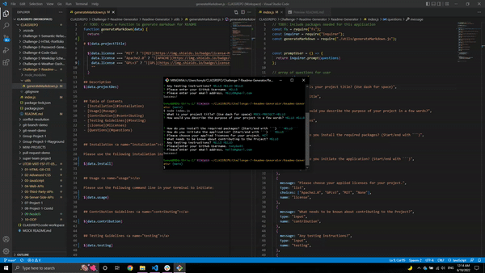

# Read-Me-Generator

  

## Description
This is my first attempt at making a readme.md file generator using user prompt functions from inquirer package.




## Table of Contents
- [Installation](#installation)
- [Usage](#usage)
- [Contribution](#contributing)
- [Testing Guidelines](#testing)
- [License](#licenses)
- [Questions](#questions)


## Installation <a name="installation"></a>

Please use the following installation instructions in your terminal:

```npm init -y```
```npm install inquirer```


## Usage <a name="usage"></a>

Please use the following command line in your terminal to initiate:

```HELLO```


## Contribution Guidelines <a name="contributing"></a>

HELLO


## Testing Guidelines <a name="testing"></a>

HELLO HELLO


## Licenses <a name="licenses"></a>

This project uses  ```Massachusetts Institute of Technology```

## Questions <a name="questions"></a>

- Questions? Please [Email Me](mailto:hello@gmail.com).
- Please check my [GitHub](https://github.com/tonybs03) for more projects!
